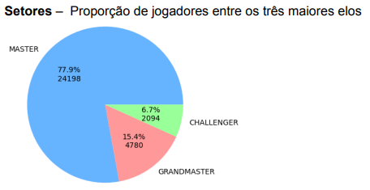
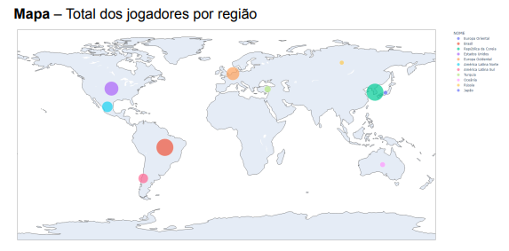
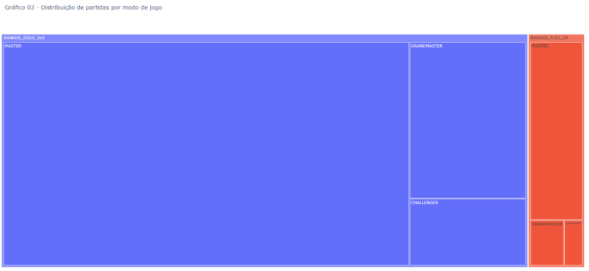
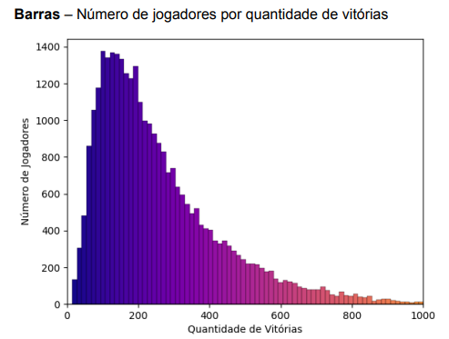
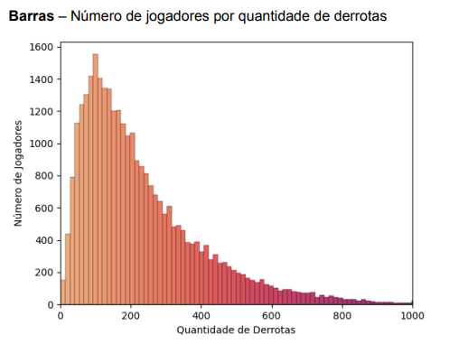

# Jogadores Mestre+ em League of Legends

Trabalho de Visualização da Informação utilizando um dataset como estudo para a geração de gráficos em Python, utilizando as bibliotecas pandas, pyplot, express e seaborn.

## Índice

-   [Visão Geral](#visão-geral)
    -   [Gráficos](#gráficos)
    -   [Conclusão](#conclusão)
-   [Materiais de Estudo](#materiais-de-estudo)

## Visão Geral

### Gráficos

<!--  -->

### Conclusão

Os gráficos representam o topo do sistema de elo do jogo multijogador League of Legends (ou LoL). Em 2022, LoL teve 180 milhões de jogadores, e estima-se que apenas ~0,34% dos jogadores estão nos elos Mestre, Grão-Mestre e Challenger somados.

Nos gráficos, é possível visualizar informações de como essa pequena porcentagem de jogadores está distribuído, através do total por cada região, a quantidade de contas com a soma de vitórias nestes elos, e a porcentagem, no gráfico de setores, de jogadores entre os ranques mais altos do jogo.

## Materiais de Estudo

-   Dataset utilizado: https://www.kaggle.com/datasets/jasperan/league-of-legends-master-players
-   Lista de elos do LoL: https://maisesports.com.br/lista-de-elos-do-lol/
-   Sistema de elo de jogos online: https://en.wikipedia.org/wiki/Elo_rating_system#Ratings_inflation_and_deflation.
-   Total e distribuição dos jogadores nos elos do LoL: https://riftfeed.gg/more/league-of-legends-rank-distribution-where-do-you-rank
# lol-rank-proportion
